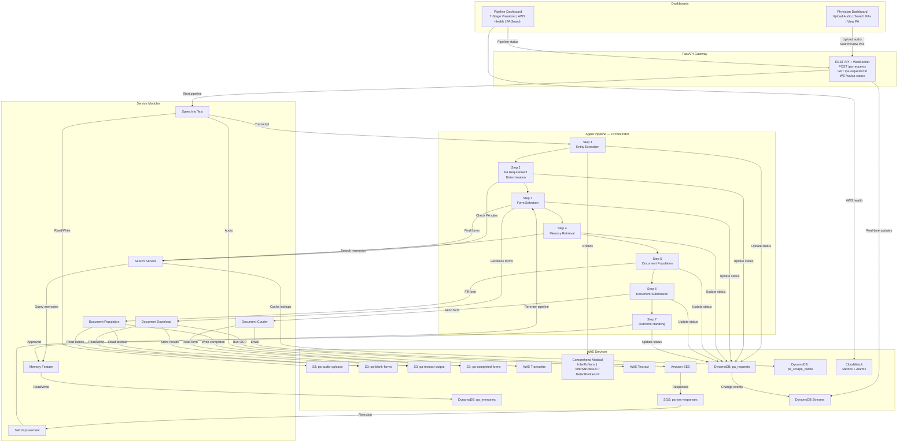

# prior_auth_bot

Automates physician prior authorization submissions — from appointment recording to form submission and appeals.

## System Architecture

## Communication Strategy

| Boundary | Mechanism | Why |
|---|---|---|
| Between pipeline steps (1-7) | Direct Python function calls | Pipeline is sequential — no network overhead needed |
| Physician Dashboard -> Backend | REST API (FastAPI) | Standard HTTP for uploads and queries |
| Pipeline status -> Dashboards | WebSocket via DynamoDB Streams | Real-time updates without polling |
| SES rejection responses -> Self Improvement | SQS queue | Only truly async boundary — insurer replies arrive hours/days later |
| All services -> Pipeline state | DynamoDB `pa_requests` table | Each step writes status before proceeding; dashboards read it |

## AWS Resource Ownership

| AWS Resource | Owner Spec | Readers |
|---|---|---|
| S3: `pa-audio-uploads` | speech_to_text | agent_pipeline |
| S3: `pa-blank-forms` | document_download | document_population, search_service |
| S3: `pa-textract-output` | document_download | document_population |
| S3: `pa-completed-forms` | document_population | document_courier, dashboards |
| AWS Transcribe | speech_to_text | — |
| AWS Comprehend Medical | agent_pipeline (Step 1) | — |
| AWS Textract | document_download | — |
| Amazon SES | document_courier | — |
| SQS: `pa-ses-responses` | document_courier | self_improvement |
| DynamoDB: `pa_requests` | agent_pipeline | all dashboards, all services |
| DynamoDB: `pa_memories` | memory_feature | search_service |
| DynamoDB: `pa_scrape_cache` | search_service | — |
| CloudWatch Metrics/Alarms | pipeline_dashboard | — |
| DynamoDB Streams | agent_pipeline | pipeline_dashboard |

## Specs

| Spec | Description |
|---|---|
| [Architecture](architecture.md) | System overview and design decisions |
| [Agent Pipeline](agent_pipeline.md) | 7-step orchestration pipeline |
| [Speech to Text](speech_to_text.md) | Audio transcription via AWS Transcribe |
| [Search Service](search_service.md) | Form and memory search with caching |
| [Memory Feature](memory_feature.md) | Learning storage in DynamoDB |
| [Document Download](document_download.md) | Blank form retrieval and Textract processing |
| [Document Population](document_population.md) | LLM-powered form filling |
| [Document Courier](document_courier.md) | Form submission via SES/fax |
| [Self Improvement](self_improvement.md) | Rejection handling and appeals |
| [Pipeline Dashboard](pipeline_dashboard.md) | Ops monitoring dashboard |
| [Physician Dashboard](physician_dashboard.md) | Doctor-facing interface |